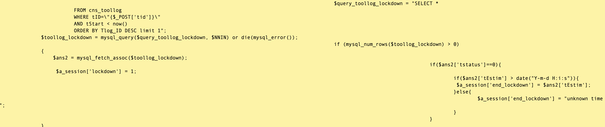

Title: Anthropology of Code
Date: 2019-06-20 11:00
Category: In-House Code
Tags: In-House Coding


### I kinda like trying to figure out how code came to be
I first started working as an In-House Coder at Glaxo-Wellcome in the late 90s and
then Genetics Institute / Wyeth in the early aughts.  Though I started the latter
job with a mandate to make shiny new Java code, I ended up having to deal with
"legacy" Perl, bash / tcsh (there were a number of SGI machines), and Makefiles.
I'll talk about that whole Java / Perl thing at some point, but suffice it to say
that other people's Perl, tcsh, and Makefiles are a rude way to get started with
legacy support and migration.

One thing I started to notice was that the background of the coder could have a
lot to do with how the code was written.

### Non-idiomatic code can give you a clue about what to expect
At the time, a lot of people were using
Perl, especially in the Bioinformatics world, because of the powerful text processing,
the value of CPAN, and, particularly, CGI.pm.  But there were two kinds of people
that I saw using Perl,

1. The shell scripters that needed a little some thing extra.  You'd see things like this
    in their code (doing things with shell tools that could be done with Perl):

       ```
       $val = `sed 's/something/else/g' < $file | grep '^>'`
       ```


2. The professional, object-oriented coders that are forced to use Perl (this was peak OO years).
   You'd see things like this:


        package Gene;
        use strict;

        sub new {
            my ($class,$args) = @_;
            my $self = bless {
                accession => $args->{accession},
                sequence => $args->{sequence},
                organism => $args->{organism}
            }, $class;
        }

        sub get_accession {
            my $self = shift;
            return $self->{accession}
        }
        sub set_accession {
            my $self, $acc = @_;
            return $self->{accession} = $acc;
        }
        ...

        1;

I'm sure there were other types.  "People that had no business coding", "High quality Perl".
I just didn't know any.

I didn't really understand *non-idiomatic* code at the time; it never dawned
on me that someone would write one language in the idiom of another.  Given
that particular time in history, an explosion of non-coders and new, web-oriented
technologies, it's not surprising that it would be prevalent.

Assuming you have widespread experience, though, understanding that idioms are
being mixed and matched can help a lot in dealing with software problems that come
up.  If your Perl code is object oriented, make sure you have a stack trace available;
if it's an agglomeration of backticks from a bash-ist, don't bother.

### Code can tell you about changes to a project scope, team, etc.
We have a software system at Harvard called Spinal that does scientific instrument reservations
for a number of our core facilities.  It's a Django application that has been around
for at least 7 or 8 years.  One thing that you notice right away is that the reservation
portion of the software is much cleaner than the billing part.  Classes are well named,
methods are pretty well thought out, and user interface elements (Django templates and views)
are simple and straightforward.  It's pretty obvious that this was the original intent
of the software and that the developers had ample time to design and iterate the code.

Billing, on the other hand, got out of control.  There was a basic design that would have sufficed
for the simple case of charging single reservation to a single account.  Scope then ballooned to include
split charges, discounts for undergraduates (gotta figure out who's an undergraduate now), and
merging of actual usage to reservation time blocks.  There are huge billing functions.  Naming of
functions and classes are ambiguous.  Billing records have to be deleted and recreated frequently.

Personnel changed as well, including management.  This resulted in an application that was entirely
Django, plus a bit of Javascript here and there ending up with a TastyPie REST API and AJAX forms
composed mostly with Underscore.js and JQuery UI.

### Code can tell you where a company is going
For a brief period in 2008, I worked for a now defunct DNA Sequencing instrument maker.  I
worked along side some very good C++ developers that were buiding a suite of command-line
tools for working with the sequencing data and their new binary file format.  Most
of the tools were straightforward, with a handful of options.  The tool responsible for
determining the error rates of a sequencing run, however, was a different story.
The help option would print several screens of information about different ways to calculate
error rates.  It was also physically the largest of the binaries by a lot.

Though the company stopped production because of the financial crisis that year, it
was pretty clear that it would be difficult to paper over the high base error rates.  Though
not for lack of trying.

### Sometimes, though, code remains a mystery.
There is another legacy system that we have at Harvard that is a large body of PHP
code accumulated over the better part of a decade by mostly a single developer.
This is a truly terrible code base to work with, but, even so, the anthropolgy is
interesting.

For example, it is clear that the author was deathly afraid of touching
any code that was working, possibly due to running for 10 years without source code
control of any kind.  Entire swathes of code are copied from one php file into the
next and adjusted for the new functionality.  Even function definitions are copied
and wrapped with "if (!function_exists) {}".

He also must have worked on a tiny screen, like 640x480.  There is no extra white
space in most lines, e.g.

    if($row_contG['Group_Name']!=="Information Technology"){
    echo $row_contG['Group_Name'];}else{echo "I.T.";}
    echo "</option>";
    }

Is there any other explanation?  Saving key strokes?

But then there are sections like this one (click to see it full size):

<div style="margin: 0 5%; box-shadow: 0 3px 1px -2px rgba(0,0,0,.2), 0 2px 2px 0 rgba(0,0,0,.14), 0 1px 5px 0 rgba(0,0,0,.12);">
    <a href="images/unintelligible.png">
        
    </a>
</div>

Where does this come from?  And why did it stay like this?  I can posit some kind of
tab-related issue; maybe his tab stops were absurdly low, like 1 or 2 spaces, and he
used actual tab characters.  Then when tabs got converted to spaces (as they should
always be), this happened.

But why just some of the lines?  Spaces for some lines and tabs for others?  Did he
switch to a new editor and eventually catch it?

And why not fix it?  Did he never come back to it?  Was he so afraid of touching
something that worked that he wouldn't even clean up whitespace?

Some mysteries may never be solved.