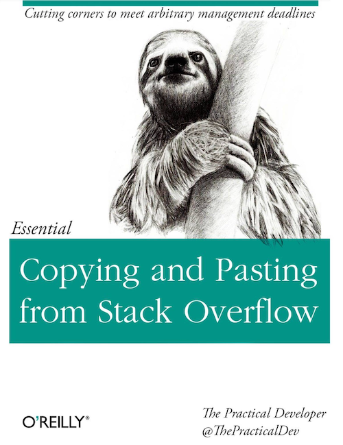

Title: Introduction
Date: 2019-06-20 11:00

### I should probably start by explaining what HouseBoyCoder means
So I recently started to read code and tech-oriented blogs regularly.
That is pretty unremarkable until you realize that I have been writing code
for a living for just over 20 years.  Seems like I should have started a while ago.

When I say "reading blogs" I mean actually reading articles.  I've been copy-pasting
from StackOverflow for many years now

    

I have read through several Linus Torvalds rants, like

* [Kernel development in C++](http://harmful.cat-v.org/software/c++/linus)

and enjoyed articles of the "Considered Harmful" variety

* [Go To Statement Considered Harmful](https://homepages.cwi.nl/~storm/teaching/reader/Dijkstra68.pdf)
* [Csh Programming Considered Harmful](https://www-uxsup.csx.cam.ac.uk/misc/csh.html)

including

* [“Considered Harmful” Essays Considered Harmful](https://meyerweb.com/eric/comment/chech.html)

and, especially, of the "fractal of bad design" class.

* [PHP is a fractal of bad design](https://eev.ee/blog/2012/04/09/php-a-fractal-of-bad-design/)

But the occasional article was leaving me out of a lot of loops.  So, I started with a couple of
obvious places, YCombinator's [Hacker News](http://news.ycombinator.com)
and a Medium account with a bunch of relevant tags.

I read a lot of interesting articles, but it eventually dawned on me how irrelevant
much of it was to what I do.

### The writing style here is a knock-off of Strunk and White's Elements of Style
I was given a copy of Strunk and White's Elements of Style back in high school by a teacher.  If I
remember correctly, it was a teacher that seem to think my approval was more important
that it should have been.

Elements of Style, if you haven't seen it, is a Hemingway-ian exercise in succinctness.  But, in particular, I loved the clear declaration at the beginning of each section.  Under Elementary Rules of Usage,
for example, you get

    3. Enclose parenthetic expressions between commas.

It is abundantly clear what you are going to get from that section of the document.  tl;dr is built in.
As a result, the Table of Contents for Elements of Style is useful all by itself.  Imagine the
documentation of tools and libraries and languages written in the same style.  I've done this kind
of thing before in various contexts, like the FAS RC documentation I setup a while back.

* [Odyssey Quick Start Guide](https://web.archive.org/web/20150417194437/https://rc.fas.harvard.edu/resources/odyssey-quickstart-guide/)

Section titles like "Objects", "Database", "Functions" are good for breaking things up, but they tell you
very little about the content.  A simple, declarative header can not only be good for users, but also help
ensure that your writing says something clear and significant.  It can ensure that your document section
[does one thing and only one thing](https://en.wikipedia.org/wiki/Single_responsibility_principle), just
like your code.
