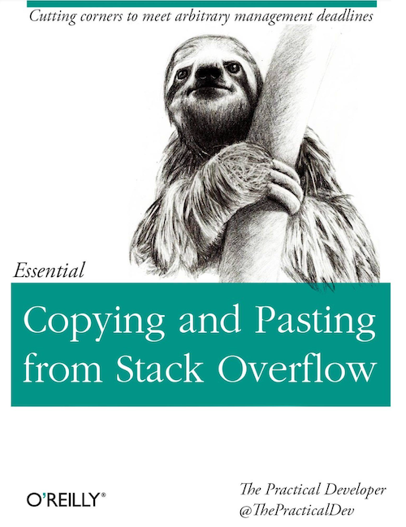
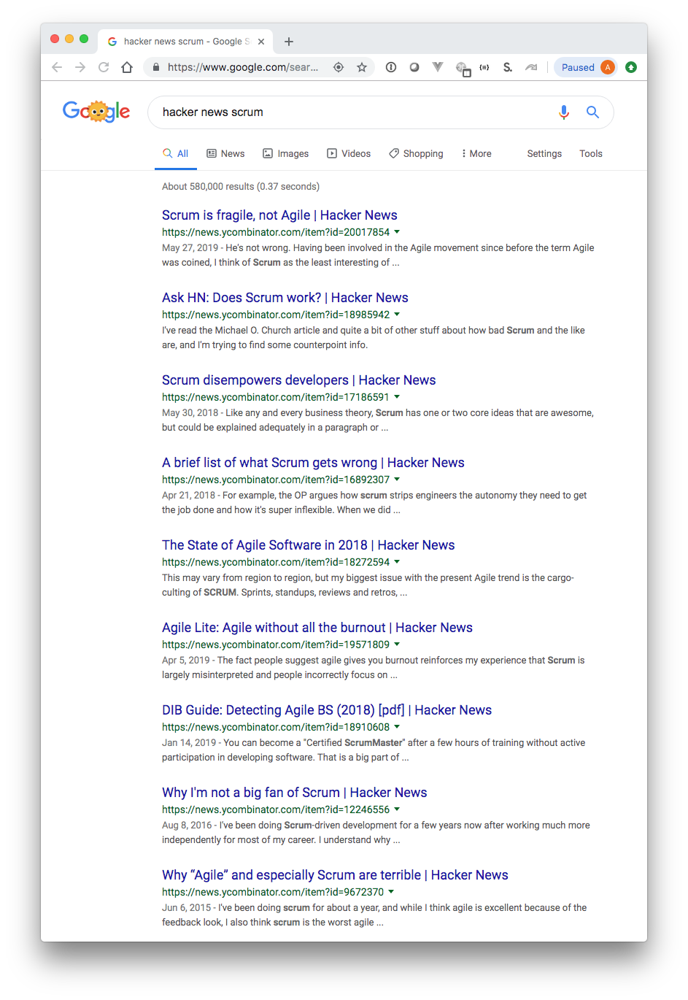

Title: Introduction
Date: 2019-06-20 11:00
Category: Introduction
Tags: In-House Coding

### I should probably start by explaining what HouseBoyCoder means
So I recently started to read code and tech-oriented blogs regularly.
That is pretty unremarkable until you realize that I have been writing code
for a living for just over 20 years.  Seems like I should have started a while ago.

When I say "reading blogs" I mean actually reading articles.  I've been copy-pasting
from StackOverflow for many years now

    

I have read through several Linus Torvalds rants, like

* [Kernel development in C++](http://harmful.cat-v.org/software/c++/linus)

and enjoyed articles of the "Considered Harmful" variety

* [Go To Statement Considered Harmful](https://homepages.cwi.nl/~storm/teaching/reader/Dijkstra68.pdf)
* [Csh Programming Considered Harmful](https://www-uxsup.csx.cam.ac.uk/misc/csh.html)

including

* [“Considered Harmful” Essays Considered Harmful](https://meyerweb.com/eric/comment/chech.html)

and, especially, of the "fractal of bad design" class.

* [PHP is a fractal of bad design](https://eev.ee/blog/2012/04/09/php-a-fractal-of-bad-design/)

But the occasional article was leaving me out of a lot of loops.  So, I started with a couple of
obvious places, YCombinator's [Hacker News](http://news.ycombinator.com)
and a Medium account with a bunch of relevant tags.

I read a lot of interesting articles, but I started to notice how irrelevant
much of it was to what I do. [Clojure for the Erlang VM](https://news.ycombinator.com/item?id=20219563)? 
[An operating system in Rust](https://news.ycombinator.com/item?id=18903235)? (Is it just me,
or is Hacker News Rust-ier than a 1970 Ford Pinto from Cape Cod?), a heated discussion about 
whether [Javascript is Scheme](https://news.ycombinator.com/item?id=6068360).  Interesting enough
to click on, but not very relevant.

I also liked project stories and software process articles.  Process has been an 'interesting'
topic at various past jobs and war stories are always fun.  It was heartening to find out that
Agile / Scrum does not solve everyone's problems, though they do tend to pile on.

    

It finally became clear why so many of these things were interesting, but irrelevant.  
Why I felt behind because I didn't need Kubernetes.  Why advice about aggressive refactoring
and converting everything to GraphQL seemed so insane.

I am an In-House Coder.

The majority of my time is spent doing every kind of software and technology task *other* than
building a product. I maintain legacy applications.  I write small scripts to automate data
transfer.  I move PHP  written by long departed post-docs on a CentOS 5 box to a 
container on a CentOS 7 VM. 

There are no Scrum sprints for publishing an R/Shiny application written by a data scientist.  You
just do it when you get the chance.  An ELK stack for my 7 or 8 Django applications and half-dozen 
PHP sites would be great, but not really worth it (and as noted in the "fractal" article, PHP
logging is baffling nonsense at best).  Aggressive refactoring of undocumented legacy applications
with nary a test, whose authors have fled the coop, does little more than anger users that just
want the thing to keep working.

I have a lot less in common with John Carmack than with this guy.

    

 
Hence the brandishing of the HouseBoyCoder moniker.  

That said, I have to admit that my "house" is Harvard University, one of the better places to be a house boy.
Despite there being a long list of legacy systems and mundane tasks, I do get to work with some excellent
people who are doing fascinating things.  And there are moments of my job that are truly fun.

### I'll be shooting for a writing style like Strunk and White's Elements of Style
I was given a copy of Strunk and White's Elements of Style back in high school by a teacher.  If I
remember correctly, it was a teacher that seem to think my approval was more important
that it should have been.

Elements of Style, if you haven't seen it, is a Hemingway-ian exercise in succinctness.  
But, in particular, I loved the clear declaration at the beginning of each section.  
Under Elementary Rules of Usage, for example, you get

    3. Enclose parenthetic expressions between commas.

It is abundantly clear what you are going to get from that section of the document.  tl;dr is built in.
As a result, the Table of Contents for Elements of Style is useful all by itself.  Imagine the
documentation of tools and libraries and languages written in the same style.  I've done this kind
of thing before in various contexts, like the FAS RC documentation I setup a while back.

* [Odyssey Quick Start Guide](https://web.archive.org/web/20150417194437/https://rc.fas.harvard.edu/resources/odyssey-quickstart-guide/)

Section titles like "Objects", "Database", "Functions" are good for breaking things up, but they tell you
very little about the content.  A simple, declarative header can not only be good for users, but also help
ensure that your writing says something clear and significant.  It can ensure that your document section
[does one thing and only one thing](https://en.wikipedia.org/wiki/Single_responsibility_principle), just
like your code.

